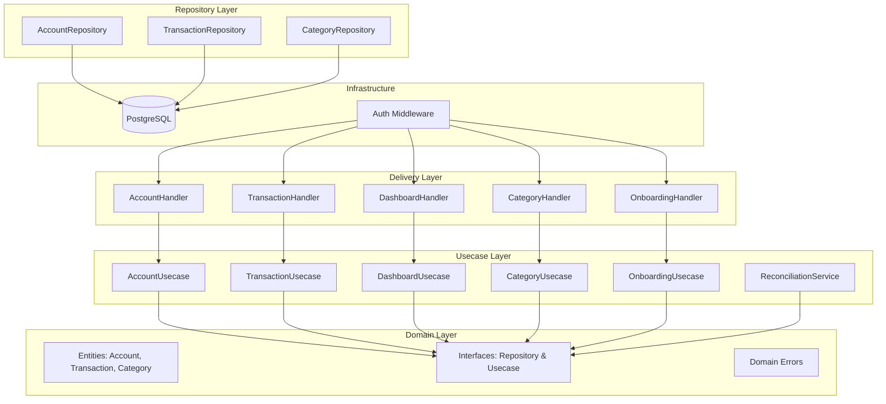
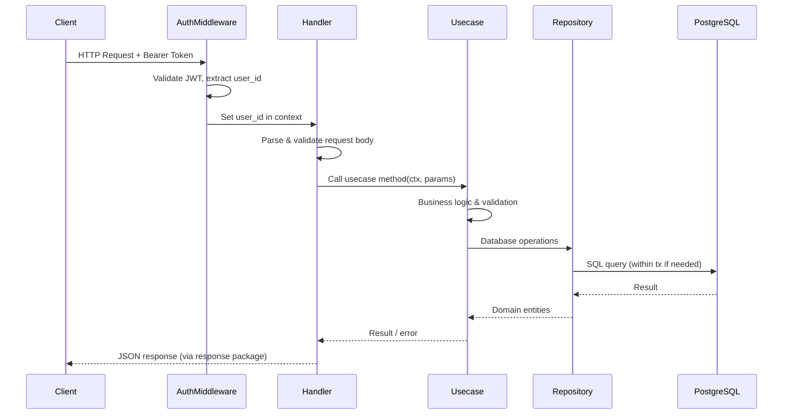
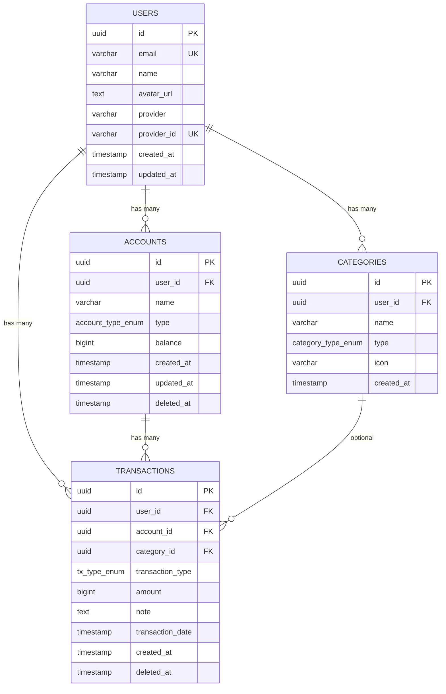

# Dokumen Design — Titik Nol Backend

## Overview

Dokumen ini mendeskripsikan desain teknis untuk fitur-fitur backend Titik Nol yang belum diimplementasi (UC-03 sampai UC-15). Desain mengikuti pola Clean Architecture yang sudah ada di codebase, dengan dependency yang mengarah ke dalam: `delivery/http → usecase → domain ← repository`.

Fitur-fitur yang dicakup:
- **Onboarding (Titik Nol)**: Bulk insert akun dengan saldo awal dan transaksi ADJUSTMENT
- **CRUD Akun**: List, create, update, soft-delete akun sumber dana
- **CRUD Transaksi**: Create (quick-log), list (paginasi), update, soft-delete dengan atomic balance update
- **Dashboard Summary**: Agregasi total balance, transaksi terbaru, flag needs_payday_setup
- **Kategori**: Bulk insert dan list kategori transaksi
- **Balance Reconciliation**: Background task verifikasi konsistensi saldo

Semua nilai moneter disimpan sebagai `int64` (BIGINT) dalam satuan Rupiah. Soft delete menggunakan field `deleted_at`. Semua endpoint dilindungi auth middleware yang sudah ada.

## Architecture

### Diagram Komponen



### Alur Request



### Pola Database Transaction

Untuk operasi yang membutuhkan atomicity (create transaksi + update balance, bulk insert), digunakan pola GORM transaction:

```go
// Repository menerima *gorm.DB yang bisa berupa db biasa atau tx
type TransactionRepository interface {
    WithTx(tx *gorm.DB) TransactionRepository
    Create(ctx context.Context, tx *Transaction) error
    // ...
}

// Usecase mengelola transaction boundary
func (u *transactionUsecase) Create(ctx context.Context, req *CreateTransactionRequest) (*Transaction, error) {
    return u.db.Transaction(func(tx *gorm.DB) error {
        txRepo := u.txRepo.WithTx(tx)
        accRepo := u.accRepo.WithTx(tx)
        // operasi atomik di sini
    })
}
```

## Components and Interfaces

### Domain Entities

File: `internal/domain/account.go`

```go
type AccountType string

const (
    AccountTypeCash       AccountType = "CASH"
    AccountTypeBank       AccountType = "BANK"
    AccountTypeEWallet    AccountType = "E_WALLET"
    AccountTypeCreditCard AccountType = "CREDIT_CARD"
)

type Account struct {
    ID        uuid.UUID   `gorm:"type:uuid;primaryKey;default:uuid_generate_v4()" json:"id"`
    UserID    uuid.UUID   `gorm:"type:uuid;not null" json:"user_id"`
    Name      string      `gorm:"size:100;not null" json:"name"`
    Type      AccountType `gorm:"type:account_type_enum;not null" json:"type"`
    Balance   int64       `gorm:"default:0" json:"balance"`
    CreatedAt time.Time   `json:"created_at"`
    UpdatedAt time.Time   `json:"updated_at"`
    DeletedAt *time.Time  `gorm:"index" json:"deleted_at,omitempty"`
}
```

File: `internal/domain/transaction.go`

```go
type TransactionType string

const (
    TxTypeIncome     TransactionType = "INCOME"
    TxTypeExpense    TransactionType = "EXPENSE"
    TxTypeTransfer   TransactionType = "TRANSFER"
    TxTypeAdjustment TransactionType = "ADJUSTMENT"
)

type Transaction struct {
    ID              uuid.UUID       `gorm:"type:uuid;primaryKey;default:uuid_generate_v4()" json:"id"`
    UserID          uuid.UUID       `gorm:"type:uuid;not null" json:"user_id"`
    AccountID       uuid.UUID       `gorm:"type:uuid;not null" json:"account_id"`
    CategoryID      *uuid.UUID      `gorm:"type:uuid" json:"category_id,omitempty"`
    TransactionType TransactionType `gorm:"type:tx_type_enum;not null" json:"transaction_type"`
    Amount          int64           `gorm:"not null" json:"amount"`
    Note            string          `json:"note,omitempty"`
    TransactionDate time.Time       `gorm:"not null" json:"transaction_date"`
    CreatedAt       time.Time       `json:"created_at"`
    DeletedAt       *time.Time      `gorm:"index" json:"deleted_at,omitempty"`
}
```

File: `internal/domain/category.go`

```go
type CategoryType string

const (
    CategoryTypeIncome  CategoryType = "INCOME"
    CategoryTypeExpense CategoryType = "EXPENSE"
)

type Category struct {
    ID        uuid.UUID    `gorm:"type:uuid;primaryKey;default:uuid_generate_v4()" json:"id"`
    UserID    uuid.UUID    `gorm:"type:uuid;not null" json:"user_id"`
    Name      string       `gorm:"size:100;not null" json:"name"`
    Type      CategoryType `gorm:"type:category_type_enum;not null" json:"type"`
    Icon      string       `gorm:"size:50" json:"icon,omitempty"`
    CreatedAt time.Time    `json:"created_at"`
}
```

### Domain Interfaces — Repository

File: `internal/domain/account.go`

```go
type AccountRepository interface {
    WithTx(tx *gorm.DB) AccountRepository
    Create(ctx context.Context, account *Account) error
    Update(ctx context.Context, account *Account) error
    SoftDelete(ctx context.Context, id, userID uuid.UUID) error
    GetByID(ctx context.Context, id, userID uuid.UUID) (*Account, error)
    FetchByUserID(ctx context.Context, userID uuid.UUID) ([]Account, error)
    UpdateBalance(ctx context.Context, id uuid.UUID, delta int64) error
    GetAllActive(ctx context.Context) ([]Account, error) // untuk reconciliation
}
```

File: `internal/domain/transaction.go`

```go
type TransactionRepository interface {
    WithTx(tx *gorm.DB) TransactionRepository
    Create(ctx context.Context, tx *Transaction) error
    Update(ctx context.Context, tx *Transaction) error
    SoftDelete(ctx context.Context, id, userID uuid.UUID) error
    GetByID(ctx context.Context, id, userID uuid.UUID) (*Transaction, error)
    Fetch(ctx context.Context, params TransactionQueryParams) ([]Transaction, int, error)
    SumByAccount(ctx context.Context, accountID uuid.UUID) (int64, error) // untuk reconciliation
    FetchRecent(ctx context.Context, userID uuid.UUID, limit int) ([]Transaction, error)
}

type TransactionQueryParams struct {
    UserID          uuid.UUID
    AccountID       *uuid.UUID
    TransactionType *TransactionType
    Page            int
    PerPage         int
}
```

File: `internal/domain/category.go`

```go
type CategoryRepository interface {
    WithTx(tx *gorm.DB) CategoryRepository
    Create(ctx context.Context, category *Category) error
    FetchByUserID(ctx context.Context, userID uuid.UUID, filterType *CategoryType) ([]Category, error)
    GetByID(ctx context.Context, id, userID uuid.UUID) (*Category, error)
    CountByUserID(ctx context.Context, userID uuid.UUID) (int64, error)
}
```

### Domain Interfaces — Usecase

File: `internal/domain/account.go`

```go
type AccountUsecase interface {
    Create(ctx context.Context, userID uuid.UUID, req *CreateAccountRequest) (*Account, error)
    Update(ctx context.Context, userID, accountID uuid.UUID, req *UpdateAccountRequest) (*Account, error)
    SoftDelete(ctx context.Context, userID, accountID uuid.UUID) error
    FetchByUserID(ctx context.Context, userID uuid.UUID) ([]Account, error)
}
```

File: `internal/domain/transaction.go`

```go
type TransactionUsecase interface {
    Create(ctx context.Context, userID uuid.UUID, req *CreateTransactionRequest) (*CreateTransactionResponse, error)
    Update(ctx context.Context, userID, txID uuid.UUID, req *UpdateTransactionRequest) (*UpdateTransactionResponse, error)
    SoftDelete(ctx context.Context, userID, txID uuid.UUID) error
    Fetch(ctx context.Context, params TransactionQueryParams) (*PaginatedResult, error)
}
```

File: `internal/domain/onboarding.go`

```go
type OnboardingUsecase interface {
    SetupAccounts(ctx context.Context, userID uuid.UUID, req *SetupAccountsRequest) (*SetupAccountsResponse, error)
}
```

File: `internal/domain/dashboard.go`

```go
type DashboardUsecase interface {
    GetSummary(ctx context.Context, userID uuid.UUID) (*DashboardSummary, error)
}
```

File: `internal/domain/category.go`

```go
type CategoryUsecase interface {
    BulkCreate(ctx context.Context, userID uuid.UUID, req *BulkCreateCategoryRequest) ([]Category, error)
    FetchByUserID(ctx context.Context, userID uuid.UUID, filterType *CategoryType) ([]Category, error)
}
```

### Request/Response DTOs

```go
// Account
type CreateAccountRequest struct {
    Name           string      `json:"name" binding:"required"`
    Type           AccountType `json:"type" binding:"required"`
    InitialBalance int64       `json:"initial_balance" binding:"min=0"`
}

type UpdateAccountRequest struct {
    Name string `json:"name" binding:"required"`
}

// Onboarding
type SetupAccountItem struct {
    Name           string      `json:"name" binding:"required"`
    Type           AccountType `json:"type" binding:"required"`
    InitialBalance int64       `json:"initial_balance" binding:"min=0"`
}

type SetupAccountsRequest struct {
    Accounts []SetupAccountItem `json:"accounts" binding:"required,min=1,dive"`
}

type SetupAccountsResponse struct {
    Accounts     []Account     `json:"accounts"`
    Transactions []Transaction `json:"transactions"`
}

// Transaction
type CreateTransactionRequest struct {
    AccountID       uuid.UUID       `json:"account_id" binding:"required"`
    CategoryID      *uuid.UUID      `json:"category_id"`
    TransactionType TransactionType `json:"transaction_type" binding:"required"`
    Amount          int64           `json:"amount" binding:"required,gt=0"`
    Note            string          `json:"note"`
    TransactionDate time.Time       `json:"transaction_date" binding:"required"`
}

type CreateTransactionResponse struct {
    Transaction    Transaction `json:"transaction"`
    AccountBalance int64       `json:"account_balance"`
}

type UpdateTransactionRequest struct {
    Amount          int64      `json:"amount" binding:"required,gt=0"`
    Note            string     `json:"note"`
    CategoryID      *uuid.UUID `json:"category_id"`
    TransactionDate time.Time  `json:"transaction_date" binding:"required"`
}

type UpdateTransactionResponse struct {
    Transaction    Transaction `json:"transaction"`
    AccountBalance int64       `json:"account_balance"`
}

// Dashboard
type DashboardSummary struct {
    TotalBalance      int64         `json:"total_balance"`
    RecentTransactions []Transaction `json:"recent_transactions"`
    NeedsPaydaySetup  bool          `json:"needs_payday_setup"`
}

// Category
type BulkCreateCategoryItem struct {
    Name string       `json:"name" binding:"required"`
    Type CategoryType `json:"type" binding:"required"`
    Icon string       `json:"icon"`
}

type BulkCreateCategoryRequest struct {
    Categories []BulkCreateCategoryItem `json:"categories" binding:"required,min=1,dive"`
}
```

### API Endpoints

Semua endpoint di bawah group `/api/v1` dan dilindungi `authMiddleware`.

| Method | Path | Handler | Deskripsi |
|--------|------|---------|-----------|
| POST | `/api/v1/onboarding/accounts` | OnboardingHandler.SetupAccounts | Bulk insert akun + ADJUSTMENT |
| GET | `/api/v1/accounts` | AccountHandler.Fetch | Daftar akun pengguna |
| POST | `/api/v1/accounts` | AccountHandler.Create | Tambah akun baru |
| PUT | `/api/v1/accounts/:id` | AccountHandler.Update | Update nama akun |
| DELETE | `/api/v1/accounts/:id` | AccountHandler.Delete | Soft delete akun |
| POST | `/api/v1/transactions` | TransactionHandler.Create | Buat transaksi quick-log |
| GET | `/api/v1/transactions` | TransactionHandler.Fetch | Riwayat transaksi (paginasi) |
| PUT | `/api/v1/transactions/:id` | TransactionHandler.Update | Update transaksi |
| DELETE | `/api/v1/transactions/:id` | TransactionHandler.Delete | Soft delete transaksi |
| GET | `/api/v1/dashboard` | DashboardHandler.GetSummary | Dashboard summary |
| POST | `/api/v1/categories` | CategoryHandler.BulkCreate | Bulk insert kategori |
| GET | `/api/v1/categories` | CategoryHandler.Fetch | Daftar kategori |

### Handler Pattern

Setiap handler mengekstrak `user_id` dari Gin context (di-set oleh auth middleware) dan mendelegasikan ke usecase:

```go
func (h *AccountHandler) Create(c *gin.Context) {
    userID, _ := c.Get("user_id")

    var req domain.CreateAccountRequest
    if err := c.ShouldBindJSON(&req); err != nil {
        response.BadRequest(c, "Invalid request", err.Error())
        return
    }

    account, err := h.accountUsecase.Create(c.Request.Context(), userID.(uuid.UUID), &req)
    if err != nil {
        // map domain error ke HTTP status
        handleDomainError(c, err)
        return
    }

    response.Success(c, http.StatusCreated, "Account created successfully", account)
}
```

### Domain Error Mapping

Tambahan error di `internal/domain/errors.go`:

```go
var (
    ErrAccountNotFound      = errors.New("account not found")
    ErrTransactionNotFound  = errors.New("transaction not found")
    ErrCategoryNotFound     = errors.New("category not found")
    ErrForbidden            = errors.New("forbidden: resource belongs to another user")
    ErrInvalidAccountType   = errors.New("invalid account type")
    ErrInvalidTxType        = errors.New("invalid transaction type")
    ErrInvalidCategoryType  = errors.New("invalid category type")
    ErrNegativeBalance      = errors.New("initial balance cannot be negative")
    ErrEmptyBulkRequest     = errors.New("bulk request cannot be empty")
    ErrAlreadyDeleted       = errors.New("resource already deleted")
    ErrValidationFailed     = errors.New("validation failed")
)
```

Handler memetakan error ini ke HTTP status:

```go
func handleDomainError(c *gin.Context, err error) {
    switch {
    case errors.Is(err, domain.ErrAccountNotFound),
         errors.Is(err, domain.ErrTransactionNotFound),
         errors.Is(err, domain.ErrCategoryNotFound),
         errors.Is(err, domain.ErrAlreadyDeleted):
        response.NotFound(c, err.Error())
    case errors.Is(err, domain.ErrForbidden):
        response.NotFound(c, "resource not found") // 404 bukan 403, sesuai requirement
    case errors.Is(err, domain.ErrValidationFailed):
        response.BadRequest(c, "Validation failed", err.Error())
    default:
        response.InternalServerError(c, "Internal server error", err.Error())
    }
}
```


## Data Models

### Entity Relationship Diagram



### Algoritma Balance Update

Balance akun diperbarui secara atomik menggunakan SQL `UPDATE accounts SET balance = balance + delta`. Delta dihitung berdasarkan tipe transaksi:

**Create Transaction:**
| Tipe | Delta |
|------|-------|
| INCOME | `+amount` |
| EXPENSE | `-amount` |
| ADJUSTMENT | `+amount` |

**Delete Transaction (reversal):**
| Tipe | Delta |
|------|-------|
| INCOME | `-amount` |
| EXPENSE | `+amount` |
| ADJUSTMENT | `-amount` |

**Update Transaction (amount berubah):**
```
oldDelta = calculateDelta(oldType, oldAmount)
newDelta = calculateDelta(oldType, newAmount)  // tipe tidak boleh berubah
adjustmentDelta = newDelta - oldDelta
// UPDATE accounts SET balance = balance + adjustmentDelta
```

Fungsi helper:

```go
func CalculateBalanceDelta(txType TransactionType, amount int64) int64 {
    switch txType {
    case TxTypeIncome, TxTypeAdjustment:
        return amount
    case TxTypeExpense:
        return -amount
    default:
        return 0
    }
}
```

### Reconciliation Algorithm

```go
func (s *reconciliationService) ReconcileAccount(ctx context.Context, account Account) {
    // 1. Hitung expected balance dari sum transaksi aktif
    expectedBalance, err := s.txRepo.SumByAccount(ctx, account.ID)

    // 2. Bandingkan dengan stored balance
    if expectedBalance != account.Balance {
        slog.WarnContext(ctx, "Balance mismatch detected",
            "account_id", account.ID,
            "expected_balance", expectedBalance,
            "stored_balance", account.Balance,
        )
    }
}
```

Query SQL untuk `SumByAccount`:
```sql
SELECT COALESCE(
    SUM(CASE
        WHEN transaction_type IN ('INCOME', 'ADJUSTMENT') THEN amount
        WHEN transaction_type = 'EXPENSE' THEN -amount
        ELSE 0
    END), 0
) AS expected_balance
FROM transactions
WHERE account_id = ? AND deleted_at IS NULL
```

### Pola Database Transaction (GORM)

Untuk operasi atomik, usecase menggunakan `gorm.DB.Transaction()`:

```go
func (u *transactionUsecase) Create(ctx context.Context, userID uuid.UUID, req *CreateTransactionRequest) (*CreateTransactionResponse, error) {
    var result *CreateTransactionResponse

    err := u.db.Transaction(func(tx *gorm.DB) error {
        txRepo := u.txRepo.WithTx(tx)
        accRepo := u.accRepo.WithTx(tx)

        // 1. Validasi account milik user dan belum di-delete
        account, err := accRepo.GetByID(ctx, req.AccountID, userID)
        if err != nil {
            return domain.ErrAccountNotFound
        }

        // 2. Buat transaksi
        transaction := &domain.Transaction{
            UserID:          userID,
            AccountID:       req.AccountID,
            CategoryID:      req.CategoryID,
            TransactionType: req.TransactionType,
            Amount:          req.Amount,
            Note:            req.Note,
            TransactionDate: req.TransactionDate,
        }
        if err := txRepo.Create(ctx, transaction); err != nil {
            return err
        }

        // 3. Update balance atomik
        delta := domain.CalculateBalanceDelta(req.TransactionType, req.Amount)
        if err := accRepo.UpdateBalance(ctx, req.AccountID, delta); err != nil {
            return err
        }

        result = &CreateTransactionResponse{
            Transaction:    *transaction,
            AccountBalance: account.Balance + delta,
        }
        return nil
    })

    return result, err
}
```

### Pola Repository WithTx

Setiap repository mendukung injeksi `*gorm.DB` untuk database transaction:

```go
type accountRepository struct {
    db *gorm.DB
}

func (r *accountRepository) WithTx(tx *gorm.DB) domain.AccountRepository {
    return &accountRepository{db: tx}
}

func (r *accountRepository) UpdateBalance(ctx context.Context, id uuid.UUID, delta int64) error {
    result := r.db.WithContext(ctx).
        Model(&domain.Account{}).
        Where("id = ? AND deleted_at IS NULL", id).
        Update("balance", gorm.Expr("balance + ?", delta))
    if result.RowsAffected == 0 {
        return domain.ErrAccountNotFound
    }
    return result.Error
}
```

### Soft Delete Pattern

Soft delete menggunakan field `deleted_at`. Query list selalu memfilter `deleted_at IS NULL`:

```go
func (r *accountRepository) FetchByUserID(ctx context.Context, userID uuid.UUID) ([]domain.Account, error) {
    var accounts []domain.Account
    err := r.db.WithContext(ctx).
        Where("user_id = ? AND deleted_at IS NULL", userID).
        Order("created_at DESC").
        Find(&accounts).Error
    return accounts, err
}

func (r *accountRepository) SoftDelete(ctx context.Context, id, userID uuid.UUID) error {
    result := r.db.WithContext(ctx).
        Model(&domain.Account{}).
        Where("id = ? AND user_id = ? AND deleted_at IS NULL", id, userID).
        Update("deleted_at", time.Now())
    if result.RowsAffected == 0 {
        return domain.ErrAccountNotFound
    }
    return result.Error
}
```

### Bulk Insert Pattern (Onboarding & Kategori)

Bulk insert dilakukan dalam satu database transaction. Validasi dilakukan di usecase sebelum operasi database:

```go
func (u *onboardingUsecase) SetupAccounts(ctx context.Context, userID uuid.UUID, req *SetupAccountsRequest) (*SetupAccountsResponse, error) {
    // 1. Validasi semua item terlebih dahulu
    for i, item := range req.Accounts {
        if err := validateAccountItem(item); err != nil {
            return nil, fmt.Errorf("account[%d]: %w", i, err)
        }
    }

    var resp SetupAccountsResponse

    err := u.db.Transaction(func(tx *gorm.DB) error {
        accRepo := u.accRepo.WithTx(tx)
        txRepo := u.txRepo.WithTx(tx)

        for _, item := range req.Accounts {
            account := &domain.Account{
                UserID:  userID,
                Name:    item.Name,
                Type:    item.Type,
                Balance: item.InitialBalance,
            }
            if err := accRepo.Create(ctx, account); err != nil {
                return err
            }
            resp.Accounts = append(resp.Accounts, *account)

            // Buat ADJUSTMENT hanya jika saldo awal > 0
            if item.InitialBalance > 0 {
                adjTx := &domain.Transaction{
                    UserID:          userID,
                    AccountID:       account.ID,
                    TransactionType: domain.TxTypeAdjustment,
                    Amount:          item.InitialBalance,
                    Note:            "Saldo awal (onboarding)",
                    TransactionDate: time.Now(),
                }
                if err := txRepo.Create(ctx, adjTx); err != nil {
                    return err
                }
                resp.Transactions = append(resp.Transactions, *adjTx)
            }
        }
        return nil
    })

    return &resp, err
}
```

