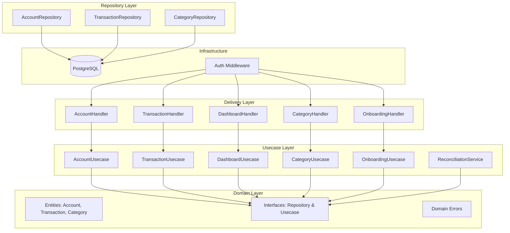
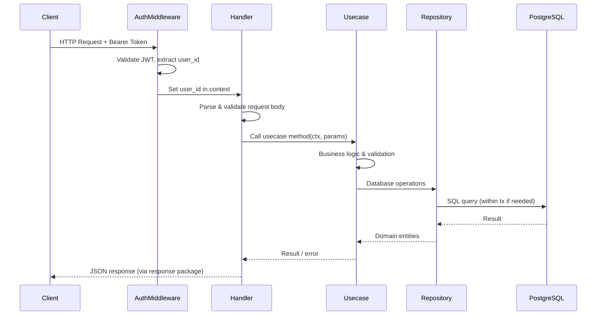
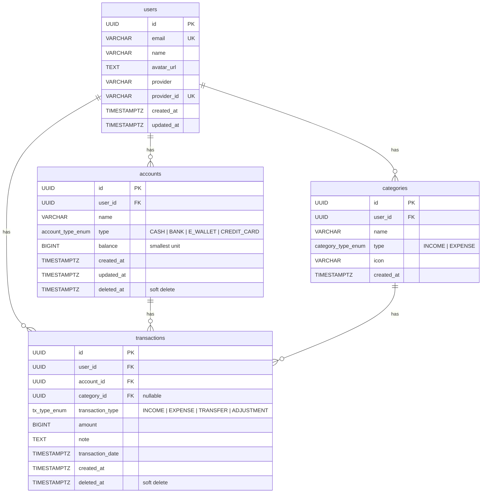

# Titik Nol Backend

Personal finance API built with Go, following Clean Architecture. Manages accounts, transactions, categories, and provides a dashboard summary — all behind Google SSO authentication.

## Tech Stack

| Layer | Technology |
|-------|-----------|
| Language | Go 1.26+ |
| Framework | Gin |
| ORM | GORM + PostgreSQL |
| Auth | Google SSO + JWT |
| Config | Viper |
| Logging | `log/slog` (structured, context-aware) |
| Testing | `testing` + testify |
| Infra | Docker + Docker Compose |

## Architecture

```
cmd/api/              → Entrypoint
internal/
  domain/             → Entities, interfaces, domain errors
  usecase/            → Business logic
  repository/         → Data access (GORM)
  delivery/http/      → Handlers + middleware (Gin)
  infrastructure/     → Config, database, logger
  pkg/                → Shared packages (JWT, Google SSO, response helpers)
migrations/           → SQL migrations (golang-migrate)
```

Dependencies flow inward: `delivery → usecase → domain ← repository`.

### Component Diagram



### Request Flow



## Getting Started

### Prerequisites

- Go 1.26+
- Docker & Docker Compose
- Make
- A Google Cloud project with OAuth 2.0 credentials (for SSO)

### Setup

```bash
# Clone the repo
git clone https://github.com/mzhryns/titik-nol-backend.git
cd titik-nol-backend

# Copy env and fill in your values
cp .env.example .env

# Start development environment (with hot-reload)
make docker-up
```

The API will be available at `http://localhost:8080`.

### Running Locally (without Docker)

```bash
# Make sure PostgreSQL is running and .env is configured
make run
```

### Production

```bash
# Build and start production containers
make docker-prod-up
```

Production uses a hardened setup: non-root user, stripped binary, resource limits, read-only filesystem, no exposed DB port, and JSON logging.

### Environment Variables

Copy [`.env.example`](.env.example) to `.env` and fill in your values. The file is self-documented with inline comments.

## API Endpoints

The interactive API documentation is available via **Scalar**:

- **UI:** `/docs/api`
- **OpenAPI Spec:** `/docs/swagger.json`

> **Note:** Run `make swagger` to regenerate the documentation after any handler changes.

Route groups overview:

- `/health` — Health check
- `/auth` — Google SSO login & current user
- `/api/v1/accounts` — Account CRUD 🔒
- `/api/v1/transactions` — Transaction CRUD 🔒
- `/api/v1/categories` — Category management 🔒
- `/api/v1/onboarding` — Initial account setup 🔒
- `/api/v1/dashboard` — Financial summary 🔒

> 🔒 = Requires `Authorization: Bearer <token>` header.

## Database Schema



## Make Commands

Run `make help` to list all available commands.

## Development Guidelines

- [API Response Standard](docs/api-response-standard.md) — all endpoints use the shared `response` package (RFC 7807 errors)
- [Testing Guidelines](docs/testing-guidelines.md) — top-level test functions, no nested subtests
- [Logger Guidelines](docs/logger.md) — context-aware `slog` usage
- [Git Commit Rules](docs/git-commit-rules.md) — Conventional Commits format
- [Google ID Setup Guide](docs/google-id-setup.md) — how to configure OAuth 2.0 credentials

## License

This project is open source under the [MIT License](LICENSE).

If you fork or modify this project, please give credit by linking back to the original repository and mentioning the author.

Built by [@zuhriyansauqi](https://github.com/zuhriyansauqi).
